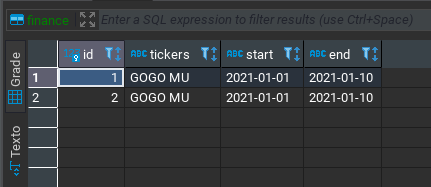

# Curso de API om Python e FastAPI

## Executar

Execute os comandos abaixo

```shell
$ pip install -r requirements.txt
$ uvicorn main:app --reload
```

Faça uma chamada ao endpoint `http://localhost:8000/finance`:

- cURL

```shell
curl -X GET \
  'http://localhost:8000/?tickers=GOGO MU&start=2021-01-01&end=2021-01-10' \
  -H 'Accept: */*' \
  -H 'User-Agent: Thunder Client (https://www.thunderclient.io)'
```

- Python Requests

```python
import requests

reqUrl = "http://localhost:8000/?tickers=GOGO MU&start=2021-01-01&end=2021-01-10"

headersList = {
 "Accept": "*/*",
 "User-Agent": "Thunder Client (https://www.thunderclient.io)"
}

payload = ""

response = requests.request("GET", reqUrl, data=payload,  headers=headersList)

print(response.text)
```
## Resultado

Verifique o arquivo `database.db` para ver que as informações foram salvadas.
Exemplo:


